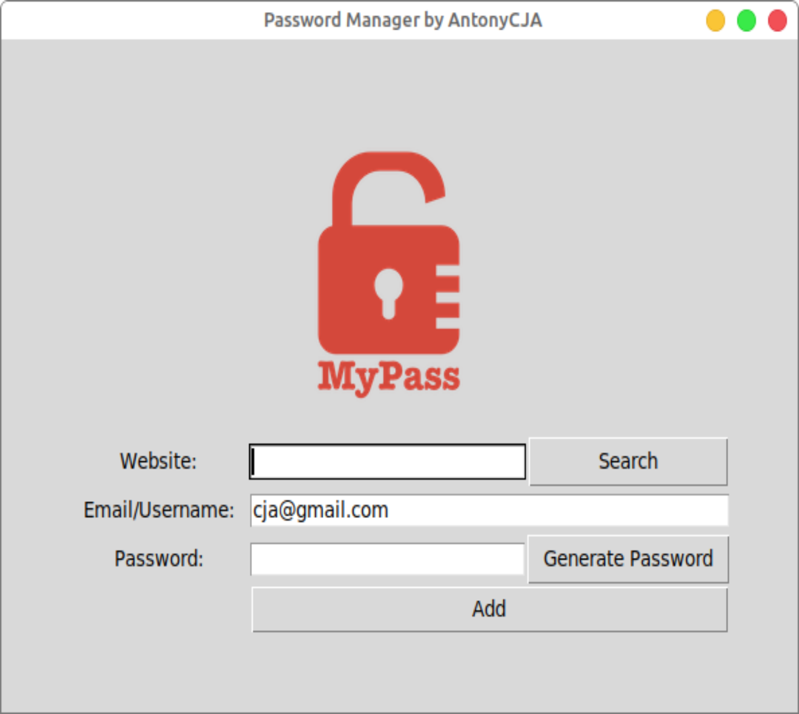

<p align="center">
  
</p>

<h1 align="center">Password Manager</h1>

<p align="center">
  <strong>Generates strong passwords and stores them in your local machine. Your password is automatically copied to your clipboard once you press Add. You can search for previously saved passwords by clicking search.</strong>
</p>

<p align="center">
  
</p>

## Features

- Generate strong passwords.
- Store and manage your passwords locally.
- Automatically copy passwords to the clipboard for easy use.
- Search for previously saved passwords.

## Installation

To use the password manager, follow the steps below:

1. **Download and install Python** on your machine from [Python.org](https://www.python.org/).

2. **Clone this repository** to your local machine using the following command:

   ```bash
   git clone https://github.com/antonycja/password_manager.git
   ```
   or
   ```bash
   git clone git@github.com:antonycja/password_manager.git
   ```
   or
   **Download the ZIP file**
   
4. **Install the required libraries** by running the following commands in your terminal:
    ```bash
      pip install pyperclip tkinter random json
    ```
5. **Run the password manager** using the following command:
   ```bash
      python password_manager.py
    ```

## How to Use
  1. Upon running the program, the password manager window will appear.

  2. To generate a new password, click on the "Generate Password" button. You can customize the password length and complexity.

  3. Click on the "Add" button to store the generated password. It will be automatically copied to your clipboard.

  4. To search for a previously saved password, enter the corresponding account or website name in the search bar and click "Search."

  5. You can view and manage all your saved passwords in the password manager window.

## Security

Your passwords are stored locally on your machine. The password manager does not send any data over the internet or to external servers. However, it is essential to keep your local machine secure with proper access controls.

**Note:** Although this password manager provides a convenient way to manage your passwords, it is always advisable to take additional security measures such as using two-factor authentication and regularly updating your passwords.
